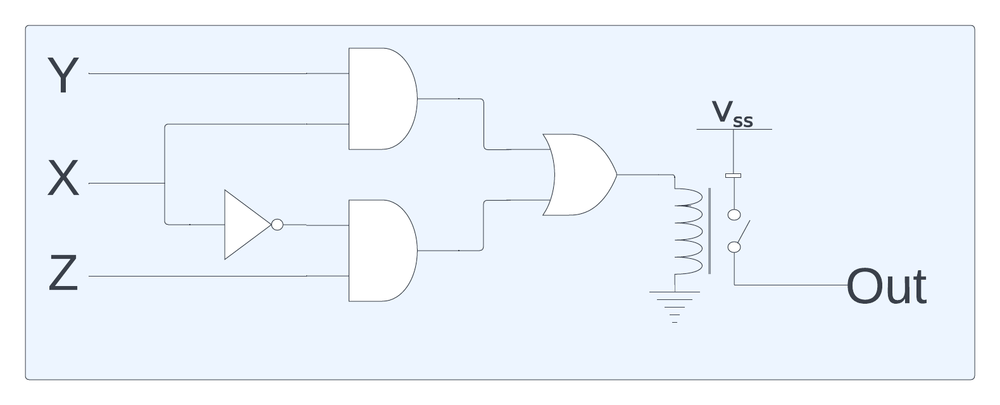
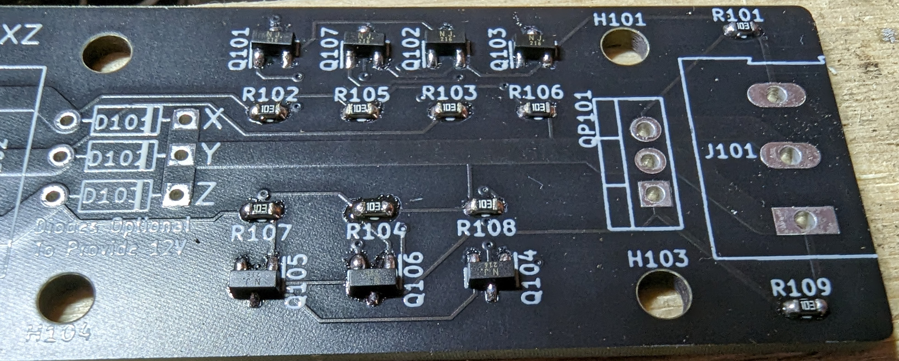

# Boolean Relay

Boolean relay is a solid state relay with mutliple inputs.  It's designed for use in a 12V automotive system.  The 12V input is relayed to the output depending on the X, Y and Z inputs.  The logic controlling the output is: (X AND Y) OR ((NOT X) AND Z).  However, it can be used for more common inputs (see below).

## Design 

### Block Diagram

### Design files
- [schematic PDF](hw/schematic_v6.0.pdf) 
- [layout PDF](hw/layout_v6.0.pdf).
- [schematic KiCad](hw/bool2.kicad_sch) 
- [layout KiCad](hw/bool2.kicad_pcb)

## Configurations

### Without diodes placed
This is the normal configuration.  In this setup, the 12V output line will be powered by the 12V input line.  There is no (well, really close to no) load on the X, Y and Z inputs.

### With diodes placed
The only good use for this is if you want a boolean type control, you don't have a separate 12V input power available and the inputs are capable of driving the output.

If the 3 diodes are placed on the board, then the 12V input power is not required.  The power to drive the output will come from some combination of the input signas (X, Y and/or Z).  It's impossible to say which input will provide the power.

## Uses

### AND 2 Inputs (XY)
**Setup**: None

**Inputs**: X and Y

**Output**: On if both X and Y inputs are on

### OR 2 Inputs (X+Z)
**Setup**: Tie Y input to 12V

**Inputs**: X and Z

**Output**: On if either X or Z input is on

### NOT 1 Input (!X)
**Setup**: Tie Z input to 12V

**Inputs**: X

**Output**: On if X is off, Off if X is on

### Buffer 1 Input (X)
**Setup**: Tie Y input to 12V

**Inputs**: X

**Output**: On if X is on, Off if X is off

### XY + !XZ
**Setup**: None

**Inputs**: X, Y & Z

**Output**: If X is on, output follows Y, if X is off, output follows Z

## Assembly

I use KiCad to generate an [SVG](img/bool2-F_Paste.svg) of the paste layer.  I use a GlowForge to cut a 5 mil peice of mylar for use as a solder mask.  I can then wipe solder paste onto the board, hand place the components, then run it through a T962 reflow oven.

